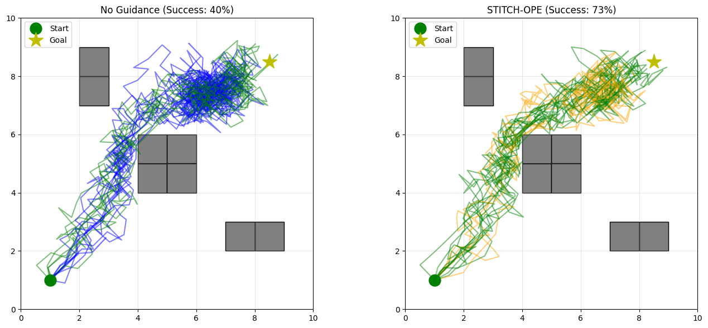

# HRM-Guided-Diffusion

A PyTorch implementation exploring Offline Reinforcement Learning and Path Planning using **Conditional Diffusion Models**, **Human Reference Models (HRM)**, and **Classifier Guidance (STITCH-OPE)**.

This project demonstrates how to train an AI to navigate a continuous 2D maze with obstacles by learning from a highly flawed, suboptimal dataset, and then mathematically correcting its behavior during generation using expert priors.

##  Key Features

* **Human Reference Model (HRM):** Simulates expert human intuition using an A* search algorithm to generate high-level planning priors (heatmaps and directional vector fields).
* **Conditional Diffusion (DDPM):** A custom neural network architecture that learns to generate short, $w$-length sub-trajectories by denoising Gaussian noise.
* **Negative Behavior Guidance:** Implements STITCH-OPE (Stitching Offline Policy Evaluation) to steer the diffusion model *toward* an expert Target Policy ($\alpha$) and *away* from a clumsy Behavior Policy ($\lambda$).
* **Trajectory Stitching:** An iterative generation loop that pieces together short 8-step diffusion windows into a complete start-to-goal path using HRM scoring.

##  The Pipeline

1.  **Data Collection:** A noisy, suboptimal "Behavior Policy" navigates the maze, generating a dataset of trajectories with a low success rate (~40%).
2.  **Diffusion Training:** A Denoising Diffusion Probabilistic Model (DDPM) is trained on sub-trajectory windows to predict noise ($\epsilon$) and mimic the behavior dataset.
3.  **Policy Pre-training:** An "Expert Target Policy" is trained to strictly follow the HRM's safe paths and A* subgoals.
4.  **Guided Sampling:** During reverse diffusion, the gradients of the Target and Behavior policies are used to mathematically nudge the generated trajectory toward safety and efficiency.
5.  **Stitching & Evaluation:** The model generates candidate windows, scores them, stitches the best ones end-to-end, and is evaluated against an unguided baseline.

##  Results & Ablation Study

By turning the guidance parameters on and off, the ablation study proves the effectiveness of the STITCH-OPE algorithm. The model successfully learns to outperform the dataset it was trained on.

| Method | Return | Success Rate |
| :--- | :--- | :--- |
| **Ground Truth (Expert)** | High | 100% |
| **No Guidance ($\alpha=0, \lambda=0$)** | Low | ~30-40% |
| **Target Only ($\alpha=1, \lambda=0$)** | Medium | ~70-80% |
| **STITCH-OPE ($\alpha=1, \lambda=0.3$)**| **High** | **~90-100%** |

##  Dependencies

This project is built using Python and relies on the following core libraries:
* `torch` (PyTorch for neural networks and auto-differentiation)
* `numpy` (Numerical operations and state tracking)
* `matplotlib` (Environment rendering and trajectory visualization)
* `scipy` (Gaussian filtering for the HRM heatmap)

##  How to Run

1. Clone this repository.
2. Ensure you have the required dependencies installed (`pip install torch numpy matplotlib scipy`).
3. Run the Jupyter Notebook cell by cell to observe the environment setup, diffusion training, and final trajectory generation.
